# Shallow NNs are Universal Function Approximators!

In this educational project, I'm going to explore the capabilities of shallow neural networks (NNs) as universal function approximators. I'll start by showing how a simple NN with n neurons is a piecewise linear function with n joints and n+1 pieces. Then, I'll demonstrate how a shallow NN can approximate any continuous function (sin(x) for example) to any desired degree of accuracy.

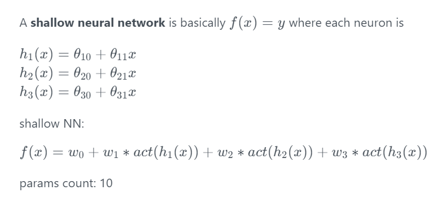

Read this book for more information: [Understanding Deep Learning](https://udlbook.github.io/udlbook/)

## Manual Shallow NN
Here you can see that each neuron models a line. 

When these lines are passed through ReLU activation functions, then multiplied by some weights, and finally summed, they can create a piecewise linear function. **ANY PIECEWISE LINEAR FUNCTION!** (with limited accuracy that is)

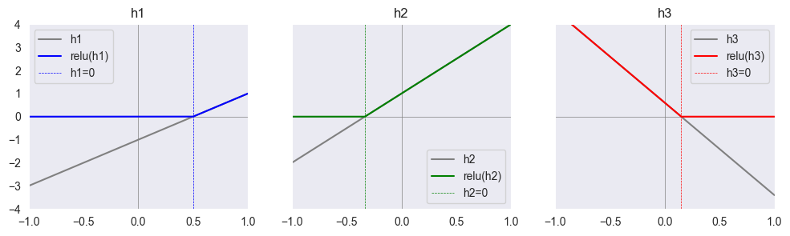

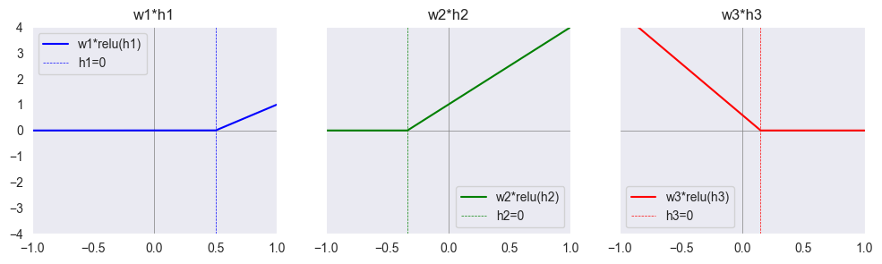

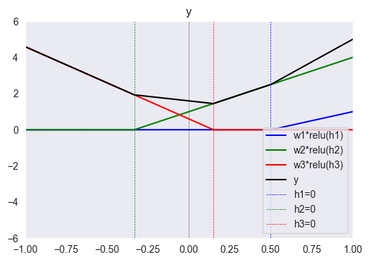

## Manual Shallow NN (Another Function)
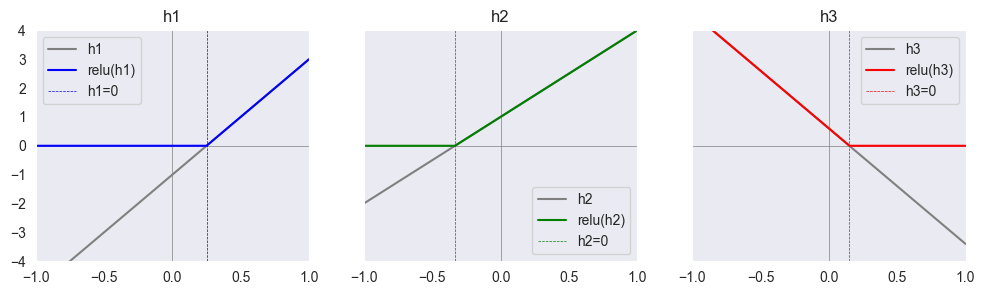

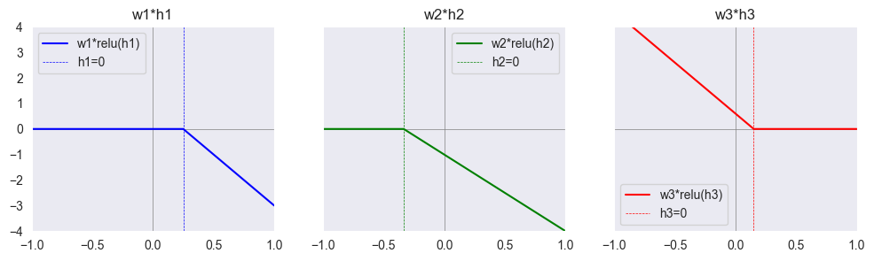

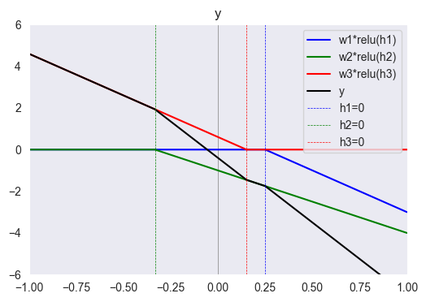

As we can see, by changing the parameters(10 in this case) we can model any function that can be constructed using 4(3+1) linear segments.

In the next part, we try to approximate sin(x) using a shallow neural network but this time we update the weights using gradient descent instead of manually changing them.

## Identity instead of ReLU
Shows the importance of non-linearity

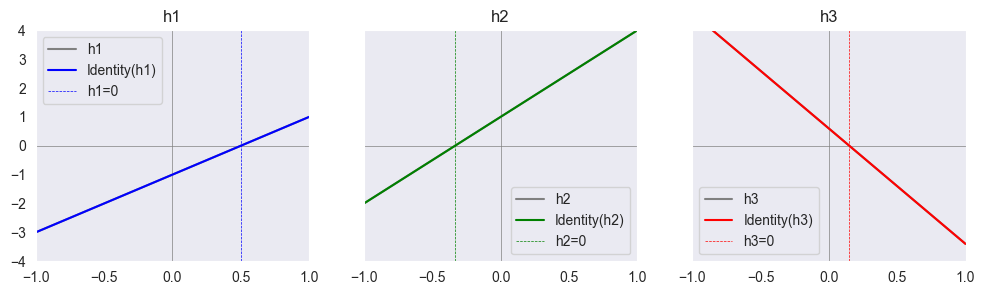

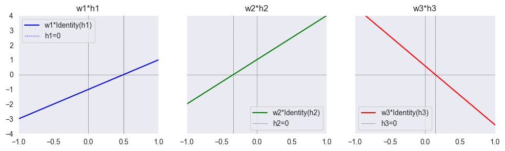

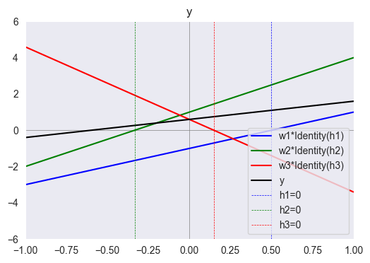

**without non-linearity this model is just another line!** (properties of linear functions)

## Approximating Sine

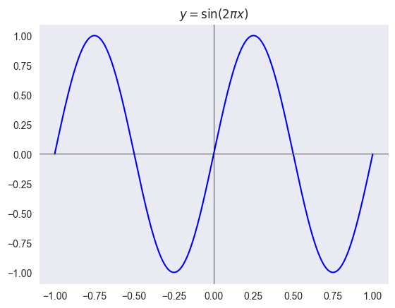

A model with 25 Neurons:

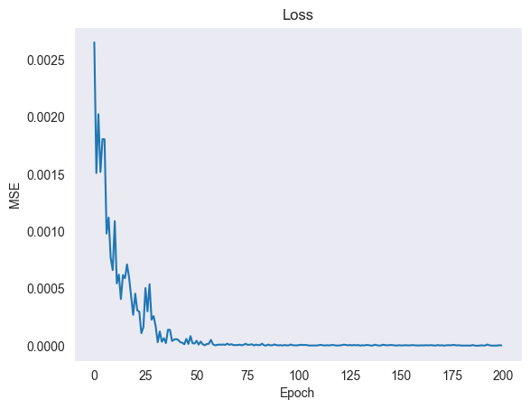
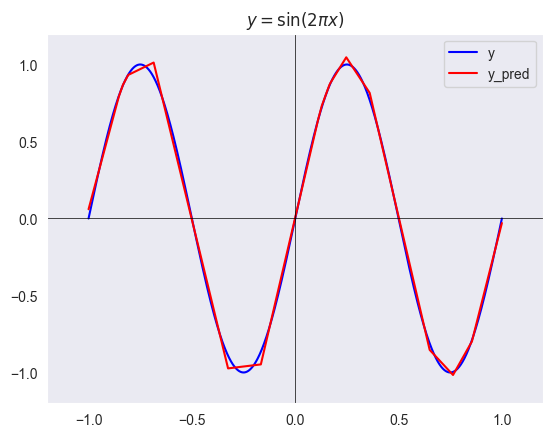

A model with 250 Neurons:

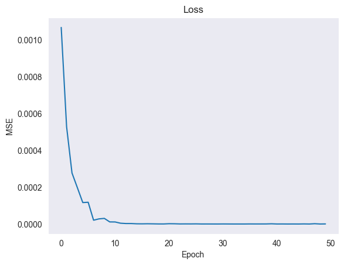
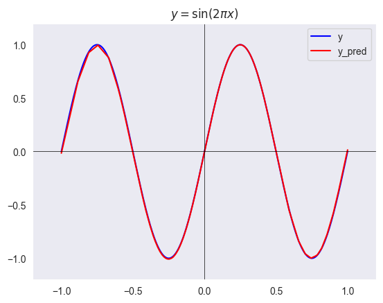

Bah Bah!!!!